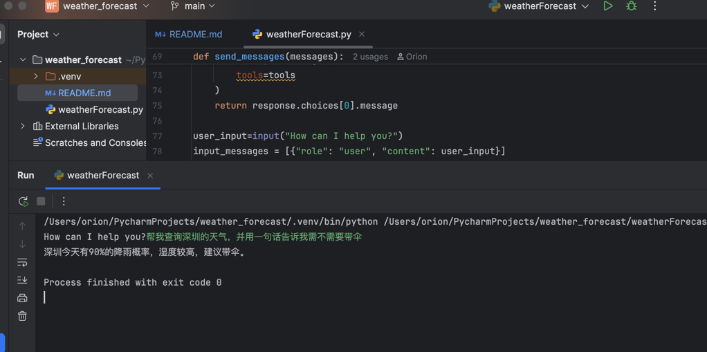

# Zijing_weather_forecast
## 使用的模型/API方式
使用的是Deepseek的API，用了deepseek的Function Calling
## 如何运行/测试
### 安装依赖:
  运行`pip install --upgrade openai`安装OpenAI的SDK
  运行`pip install python-dotenv`安装python环境变量管理包
### 配置API KEY:
  我使用的是MacBook电脑安装的pyCharm编译软件，点击Run->点击Edit Configurations...->在Environment variables里面加入Deepseek的API KEY
最后直接运行weatherForecast.py软件即可运行，看到How can I help you? 的提示之后输入文字，按回车之后会生成回复。
### 运行截图：
使用的是python3.9环境

## 哪些部分借助了 ChatGPT/搜索完成
1. 查询了deepseek Function Calling文档，CV了官网例子
2. Chat了如何提取城市名字
3. Chat了如何使用pyCharm隐藏API KEY

